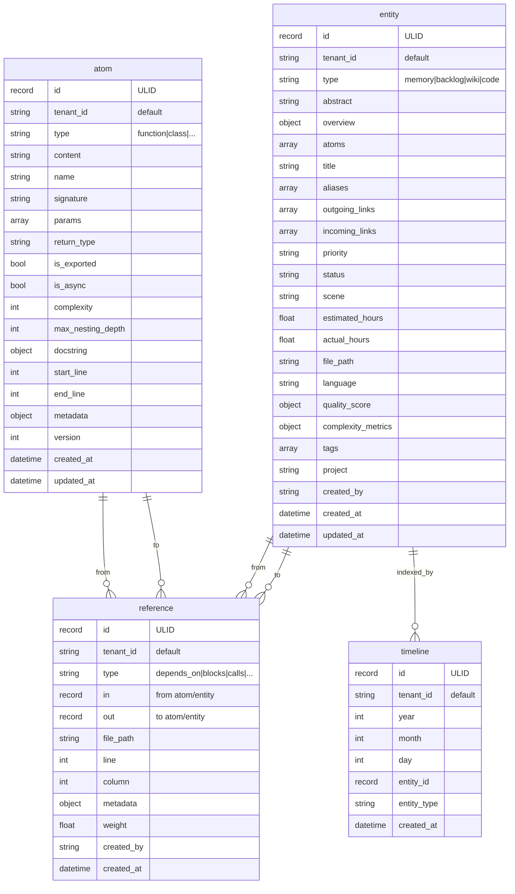
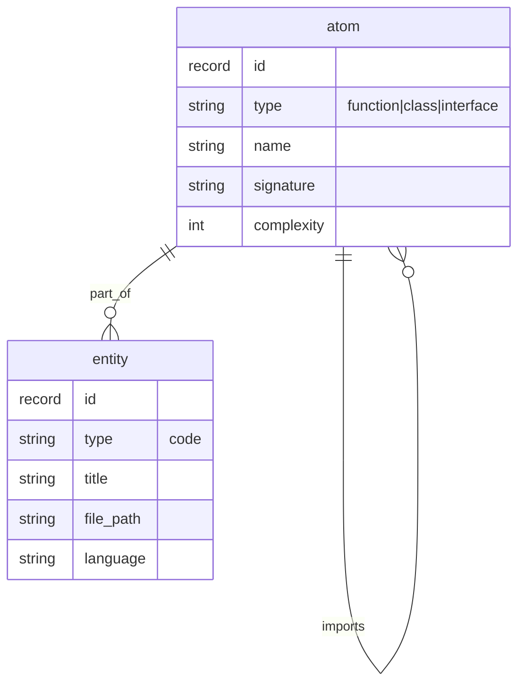
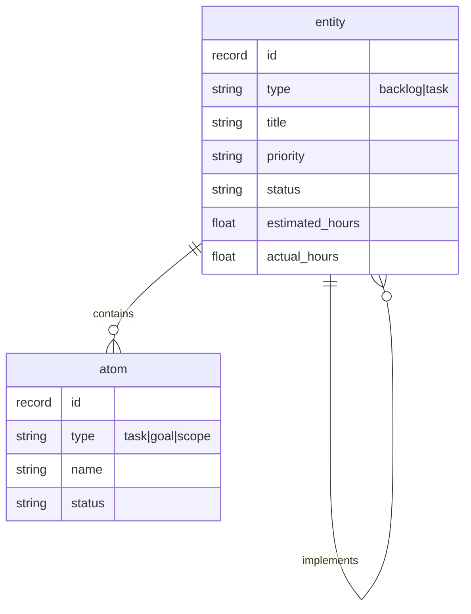
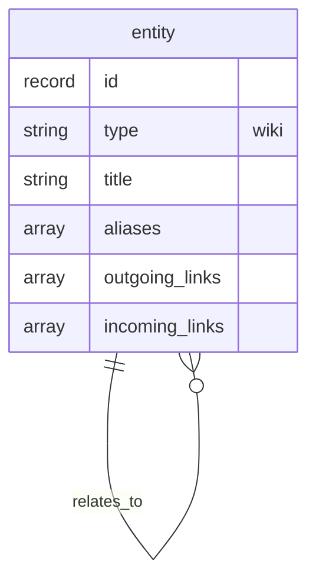
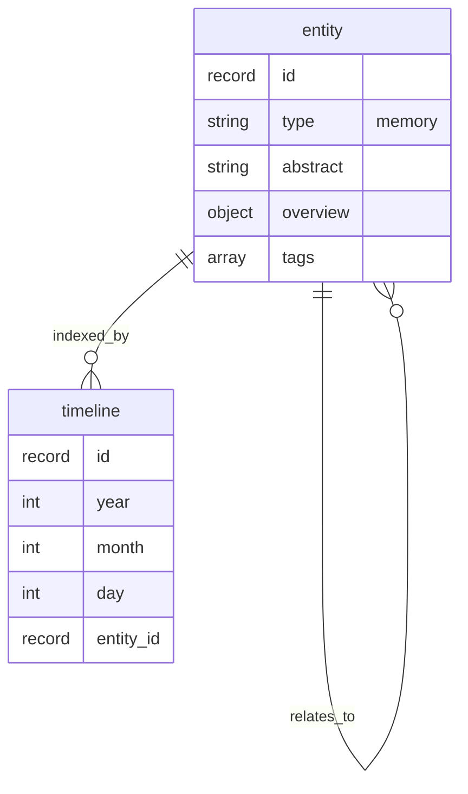
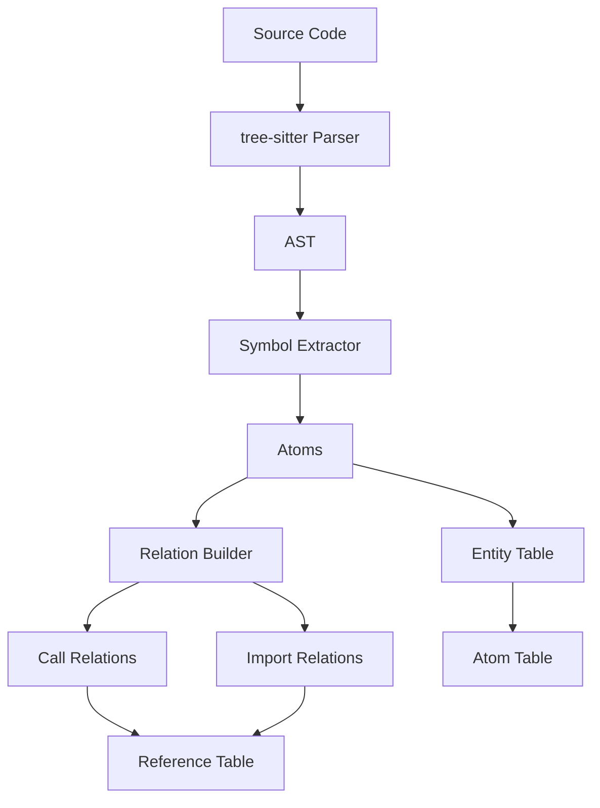
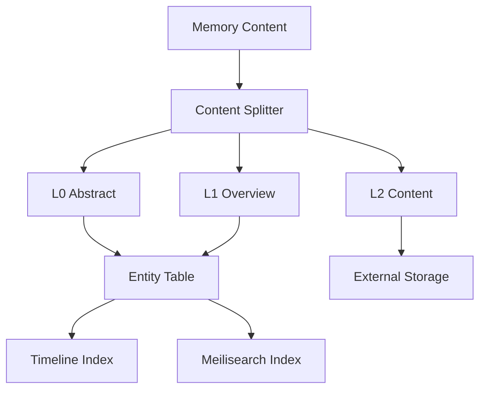
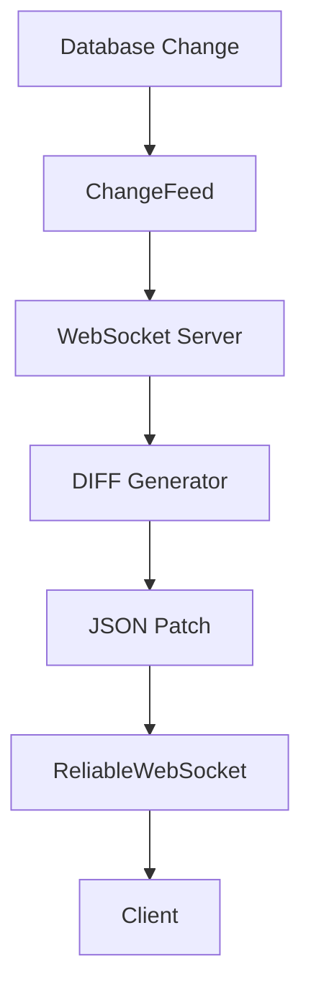
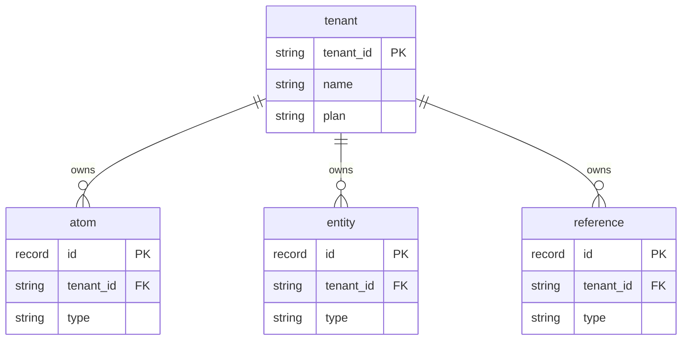
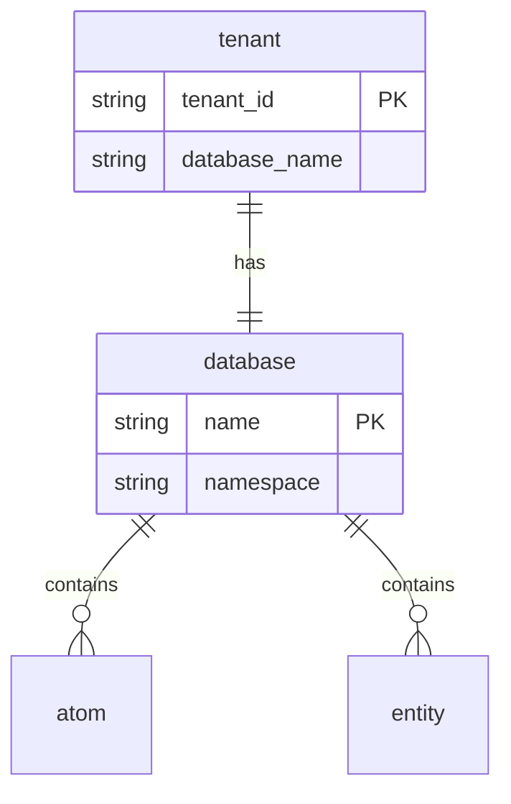

# 数据库 ER 关系图

> **版本**: v3.2.0  
> **日期**: 2026-04-10  
> **状态**: 实施版  
> **SurrealDB 版本**: 3.0+

---

## 目录

1. [核心实体关系图](#1-核心实体关系图)
2. [图关系模型](#2-图关系模型)
3. [关系类型说明](#3-关系类型说明)
4. [数据流图](#4-数据流图)
5. [多租户模型](#5-多租户模型)

---

## 1. 核心实体关系图

### 1.1 完整 ER 图

### 1.2 表结构说明

| 表名 | 类型 | 主键 | 说明 |
|------|------|------|------|
| **atom** | NORMAL | ULID | 原子级数据（函数、类、任务等） |
| **entity** | NORMAL | ULID | 实体级数据（记忆、Backlog、Wiki） |
| **reference** | RELATION | ULID | 原子/实体间关系 |
| **timeline** | NORMAL | ULID | 时间线索引 |

---

## 2. 图关系模型

### 2.1 代码关系模型

### 2.2 Backlog 关系模型

### 2.3 Wiki 关系模型

### 2.4 记忆关系模型

---

## 3. 关系类型说明

### 3.1 代码关系

| 关系类型 | 从 | 到 | 说明 | 权重因子 |
|----------|-----|-----|------|----------|
| `calls` | atom (function) | atom (function) | 函数调用关系 | 复杂度、频率 |
| `imports` | atom (file) | atom (module) | 模块导入关系 | 导入次数 |
| `part_of` | atom | entity (code) | 组成部分 | 文件内位置 |

### 3.2 Backlog 关系

| 关系类型 | 从 | 到 | 说明 | 权重因子 |
|----------|-----|-----|------|----------|
| `depends_on` | entity | entity | 依赖关系 | 阻塞程度 |
| `blocks` | entity | entity | 阻塞关系 | 优先级 |
| `implements` | entity (task) | entity (backlog) | 实现关系 | 完成度 |

### 3.3 Wiki 关系

| 关系类型 | 从 | 到 | 说明 | 权重因子 |
|----------|-----|-----|------|----------|
| `wiki_link` | entity | entity | Wiki 双向链接 | 链接频率 |
| `relates_to` | entity | entity | 一般关联 | 语义相似度 |

### 3.4 通用关系

| 关系类型 | 从 | 到 | 说明 | 权重因子 |
|----------|-----|-----|------|----------|
| `indexed_by` | entity | timeline | 时间索引 | 时间衰减 |

---

## 4. 数据流图

### 4.1 代码分析数据流

### 4.2 记忆存储数据流

### 4.3 实时同步数据流

---

## 5. 多租户模型

### 5.1 逻辑隔离（当前）

### 5.2 物理隔离（未来）

### 5.3 租户字段说明

| 表名 | 租户字段 | 默认值 | 索引 |
|------|----------|--------|------|
| atom | tenant_id | 'default' | ✅ 复合索引 |
| entity | tenant_id | 'default' | ✅ 复合索引 |
| reference | tenant_id | 'default' | ✅ 复合索引 |
| timeline | tenant_id | 'default' | ✅ 复合索引 |

---

## 参考文档

- [DATABASE-v3.2-SCHEMA.md](./DATABASE-v3.2-SCHEMA.md) - 完整 Schema 定义
- [BACKEND-v3.2-PRECOMPUTE.md](./BACKEND-v3.2-PRECOMPUTE.md) - 预计算服务设计
- [BACKEND-v3.2-WEBSOCKET.md](./BACKEND-v3.2-WEBSOCKET.md) - WebSocket 设计

---

_文档版本: v3.2.0_  
_最后更新: 2026-04-10_
